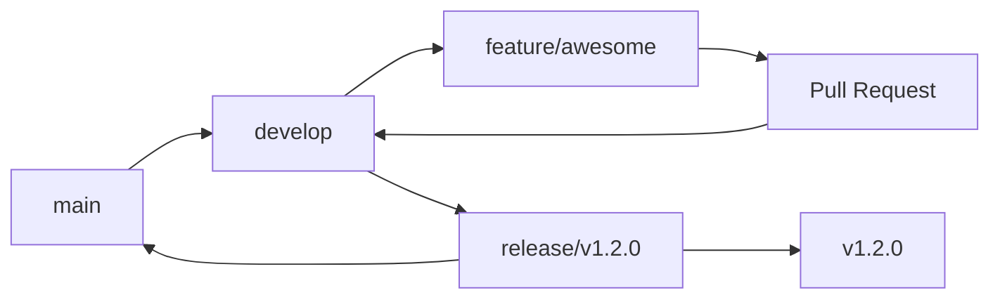
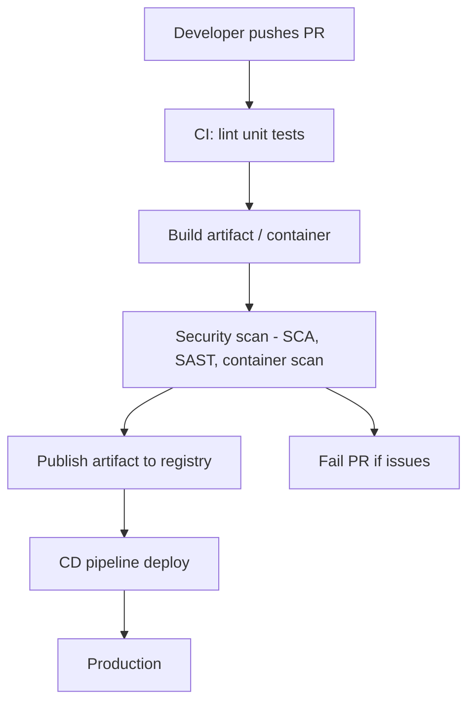

# GitHub-Repos-lifecycle
GitHub-Repos-lifecycle list of commands to manage any project repo's

# Git Repo: Start-to-End Workflow Diagrams & Commands

Visual diagrams and step-by-step commands for a typical project repository lifecycle — from setup to release and CI/CD. Use the mermaid diagrams below in compatible renderers (the canvas supports mermaid).

# 1) High-level project lifecycle (Mermaid flow)
   
```mermaid
flowchart TD
  A[Initialize repo / Clone] --> B[Create main & develop branches]
  B --> C[Create feature branch]
  C --> D[Work & local commits]
  D --> E[Push feature branch]
  E --> F[Open PR / Merge Request]
  F --> G[CI checks run]
  G --> H[Review & Approve]
  H --> I[Merge to develop / main]
  I --> J[Release tag & deploy]
  J --> K[Post-release hotfix if needed]
  K --> L[Backmerge to main / develop]
  ```

  # 2) Quick commands reference (setup & clone)

  ```bash
# configure user
git config --global user.name "Your Name"
git config --global user.email "you@example.com"

# initialize local repo
git init my-project
cd my-project

# or clone an existing remote
git clone git@github.com:org/repo.git
cd repo
```

# 3) Branching strategy (Git commands + diagram)


Typical commands to be used: 

```bash
# create & switch to branch
git checkout -b feature/my-feature

# work: stage and commit often
git add .
git commit -m "feat: add X"

# push branch upstream
git push -u origin feature/my-feature
```

# 4) Collaborative flow (PR-based merge) — steps + commands

1. Create feature branch: git checkout -b feature/issue-123
2. Develop locally, add tests, commit: git commit -am "fix: ..."
3. Rebase/sync from develop/main before pushing (recommended):

```bash
# fetch and rebase onto latest develop
git fetch origin
git checkout develop
git pull origin develop
git checkout feature/issue-123
git rebase develop

# resolve conflicts, then continue
# finish rebase
git rebase --continue

# push updated branch (may need force-with-lease)
git push --force-with-lease origin feature/issue-123
```
4. Open PR -> CI runs (lint, tests, build) -> review -> merge (prefer --no-ff or squash depending on policy)

```bash
# merge on CI: using merge commit
git checkout develop
git pull origin develop
git merge --no-ff feature/issue-123 -m "Merge feature/issue-123"
git push origin develop

# or squash locally then merge
git checkout feature/issue-123
git rebase -i develop  # squash commits interactively
git push --force-with-lease
```
# 5. Release flow (create release branch, tag & deploy)

```bash
# create release branch from develop
git checkout -b release/v1.2.0 develop
# run final tests, bump versions
git commit -am "chore(release): v1.2.0"
# merge to main and tag
git checkout main
git merge --no-ff release/v1.2.0
git tag -a v1.2.0 -m "v1.2.0"
git push origin main --follow-tags
# also merge back to develop if hotfixes
git checkout develop
git merge --no-ff release/v1.2.0
git push origin develop
```

# 6) Hotfix flow (urgent fix on main)
```bash
# create hotfix branch from main
git checkout main
git pull origin main
git checkout -b hotfix/fix-critical
# apply fix, commit
git commit -am "fix: critical issue"
# merge to main
git checkout main
git merge --no-ff hotfix/fix-critical
git tag -a v1.2.1 -m "v1.2.1"
git push origin main --follow-tags
# merge back to develop
git checkout develop
git pull origin develop
git merge --no-ff hotfix/fix-critical
git push origin develop
```

# 7) Syncing with remote & cleaning up

```bash
# fetch remote changes
git fetch origin

# update your branch with remote changes (rebase approach)
git checkout feature/branch
git rebase origin/develop

# delete remote branch after merge
git push origin --delete feature/old-branch
# delete local branch
git branch -d feature/old-branch
# force delete if not merged
git branch -D feature/old-branch
```

# 8) Undoing, stashing & inspection

```bash
# stash uncommitted changes
git stash           # stash tracked changes
git stash -u        # include untracked files
git stash list
git stash apply     # re-apply but keep stash
git stash pop       # re-apply and drop stash

# view history
git status
git log --oneline --graph --decorate

# revert a committed change (creates new commit)
git revert <commit_ID>

# reset to previous commit (dangerous: rewrites history)
git reset --hard <commit_ID>
```

# 9) CI/CD pipeline diagram (Mermaid)



Example CI Steps (commands used inside pipelines usually) 

```docker
# build docker image
docker build -t myapp:${GIT_SHA} .
# push image to registry
docker push registry.example.com/myapp:${GIT_SHA}
# run SAST (example using bandit for python)
bandit -r .
# run container scan (example using trivy)
trivy image registry.example.com/myapp:${GIT_SHA}
```

# 10) Recommended branch naming & commit message conventions

Branches: feature/, bugfix/, hotfix/, release/, chore/ (e.g. feature/auth-jwt)

Commits: Conventional Commits (e.g. feat: add user login, fix: correct validation, chore: bump deps)


11) Troubleshooting common scenarios

Conflict during rebase

```bash
# after conflict resolution
git add <file>
git rebase --continue
# abort
git rebase --abort
```
Accidentally committed secret — remove from history

Use git filter-repo or git filter-branch (with caution) and rotate secrets.

12) Appendix: full commands cheat-list (select highlights)

```bash
   git clone <url>
   git checkout -b <branch>
   git add .
   git commit -m "msg"
   git push -u origin <branch>
   git fetch origin
   git rebase origin/develop
   git merge --no-ff <branch>
   git tag -a vX.Y.Z -m "release"
   git push origin --follow-tags
   git stash, git stash pop
```


reference file :

!
